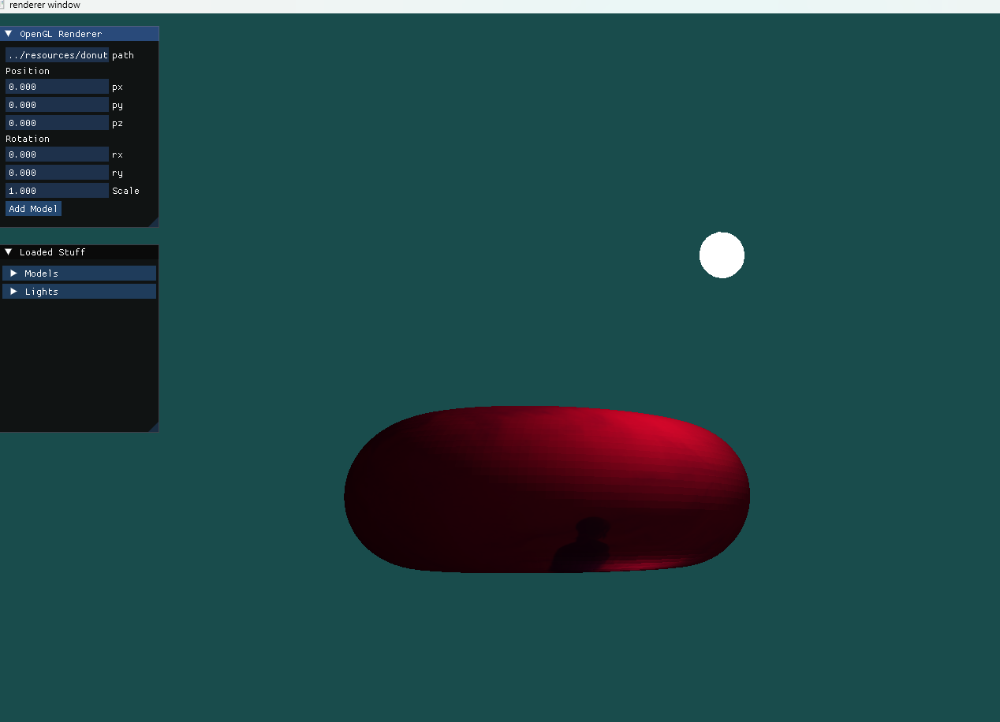
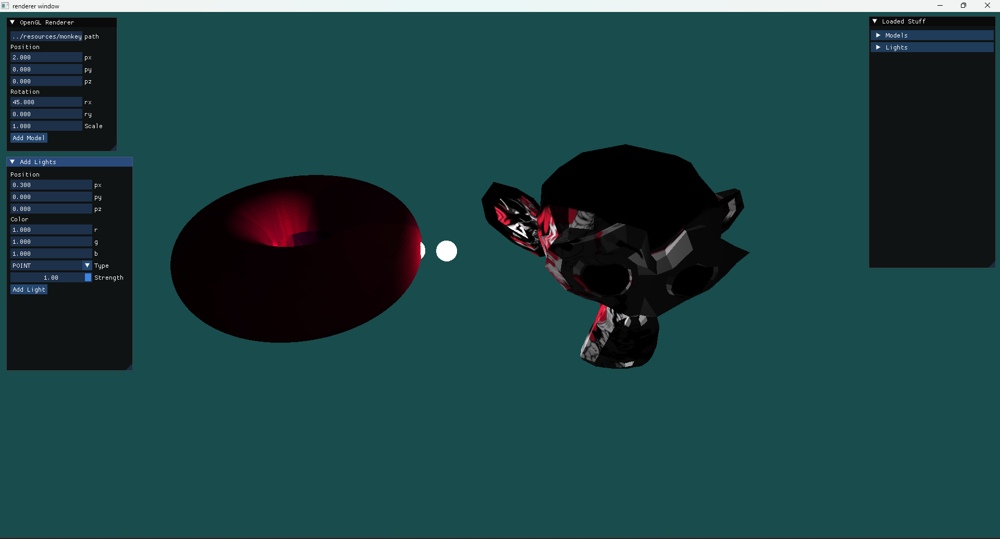
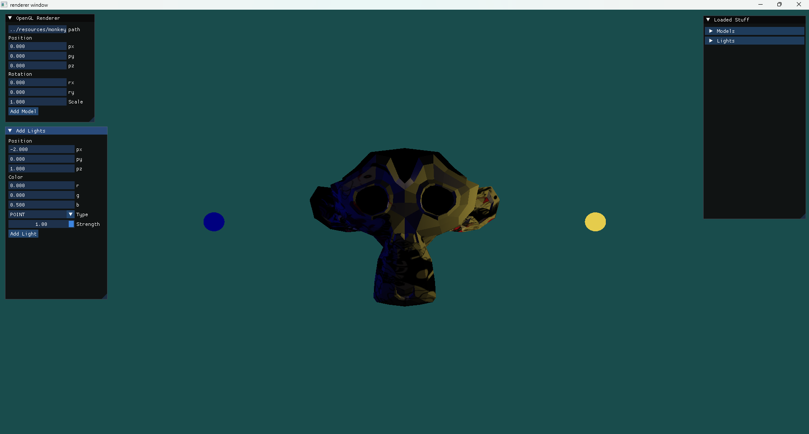

# OpenGL Renderer

A lightweight, cross-platform 3D rendering engine built using modern C++ and OpenGL. This project serves as a framework for rendering 3D graphics, handling shaders, and managing resources efficiently.

## 📷 Screenshots





## 🌟 Features
* **Modern C++ Architecture:** Clean, object-oriented design using modern C++ standards.
* **Custom Shader Support:** Direct GLSL shader support for vertex and fragment manipulation.
* **CMake Build System:** Easy to compile and build across multiple platforms (Windows, Linux, macOS).
* **Resource Management:** Modular structure for handling 3D models, textures, and rendering configurations.

## 📂 Project Structure

```text
opengl-renderer/
├── dependencies/     # External libraries (e.g., GLFW, GLAD/GLEW, GLM)
├── resources/        # Assets like 3D models and textures
├── shaders/          # GLSL vertex and fragment shaders
├── src/              # C++ source and header files
└── CMakeLists.txt    # CMake build configuration file
```

## 🛠️ Prerequisites

Before you begin, ensure you have the following installed on your machine:
* A C++17 (or newer) compatible compiler (GCC, Clang, or MSVC)
* [CMake](https://cmake.org/download/) (version 3.10 or higher)
* [Git](https://git-scm.com/)

**Note:** Included libraries such as GLFW, GLAD, or GLM are handled in the `/dependencies` folder.

## 🚀 Building the Project

This project uses CMake for building. Follow these steps to build and run the renderer locally:

### 1. Clone the repository
```bash
git clone [https://github.com/yashchaurasia667/opengl-renderer.git](https://github.com/yashchaurasia667/opengl-renderer.git)
cd opengl-renderer
```

### 2. Generate Build Files
Create a build directory and run CMake:
```bash
mkdir build
cd build
cmake ..
```

### 3. Compile the Project
```bash
cmake --build .
```

### 4. Run the Renderer
After a successful build, the executable will be located in the `build` directory.
```bash
# On Linux/macOS
./renderer

# On Windows
./renderer.exe
```

## 🤝 Contributing
Contributions are welcome! If you'd like to improve the renderer, add new shaders, or fix bugs, feel free to open an issue or submit a pull request.

1. Fork the Project
2. Create your Feature Branch (`git checkout -b feature/AmazingFeature`)
3. Commit your Changes (`git commit -m 'Add some AmazingFeature'`)
4. Push to the Branch (`git push origin feature/AmazingFeature`)
5. Open a Pull Request
